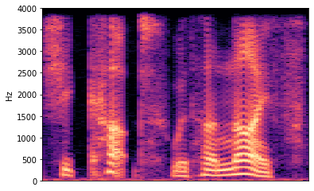
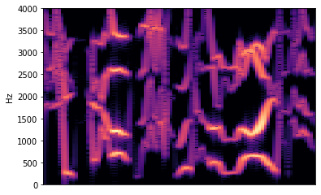

# Sine wave speech

A Python package for converting audio recordings to sine wave speech.
Sine wave speech is a method of converting speech to sounds that are utterly unintelligible on the first listen,
but with a little practice – hearing a few before-and-after examples – become easy to follow.
Check out [this video](https://www.youtube.com/watch?v=GCtTtKKAhyE) for an example.

For an example of how to use the package, see [sine_wave_speech_example.ipynb](sine_wave_speech_example.ipynb).

## What is sine wave speech?

A sound can be decomposed using the
[short-time Fourier transform](https://en.wikipedia.org/wiki/Short-time_Fourier_transform)
into a representation where at every point in time, the sound is a sum of sine waves at different frequencies
with different amplitudes.
We can visualize this representation using a spectrogram, where the X axis is time and the Y axis is the frequency.
The intensity of the color represents the amplitude of a sine wave of a given amplitude (Y axis) at a given time (X axis).
Here's the spectrogram of somebody saying "she cut with her knife":

Listen to [sentence-original.wav](sentence-original.wav).

Sine wave speech simplifies the sound drastically. Instead of representing the sound with 96 sine waves at a time
as our spectrogram does, we'll use four!
Using fancy signal processing methods ([linear predictive coding](https://en.wikipedia.org/wiki/Linear_predictive_coding)),
we determine the four most important frequencies at every point in time and _only keep those_.

You can see on the spectrogram of the modified image that only four frequencies are ever active at a time:

Listen to [sentence-sine-wave.wav](sentence-sine-wave.wav).

Needless to say, this is extremely lossy, and your ears cannot make anything out when you hear sine wave speech for the first time.
But the cool part is that with just a little practice, you will be able to understand it perfectly.

There is surprisingly little about sine wave speech on YouTube, but you can check out [this demonstration](https://youtu.be/EWzt1bI8AZ0?t=87)
for an example where you'll start off understanding nothing of the sine wave speech but after hearing the original,
you will be able to "decode" the sine wave speech version.

## Usage

See [sine_wave_speech_example.ipynb](sine_wave_speech_example.ipynb).

### Resources

The implementation is based on [code by Dan Ellis](https://www.ee.columbia.edu/~dpwe/resources/matlab/sws/)
that is older than me! See `matlab_code_archive/`.

Also interesting: http://www.columbia.edu/~remez/musical-and-poetic-sine-wave-speech.html

Dan Ellis' explanation of Linear Predictive Coding: https://www.ee.columbia.edu/~dpwe/e6820/lectures/L05-speechmodels.pdf
